# Computer Vision at ETH Zürich

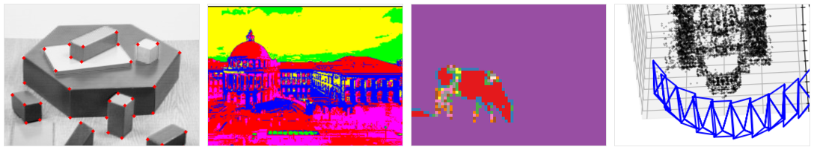

This repository contains my code for the projects of the Computer Vision course at ETH Zürich,
Fall 2024. Everything is implemented from scratch in Python, using NumPy for the classical
projects and PyTorch for the deep learning ones.

## Project 1: Harris Corner Detector

Implementation of the Harris Corner Detector, to find unique, descriptive points in images. The
following images show the detected positions in red.

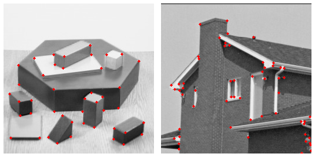

We can then use the detected points to match features between two images. The blue lines show the
matches found between two photos of the same scene.

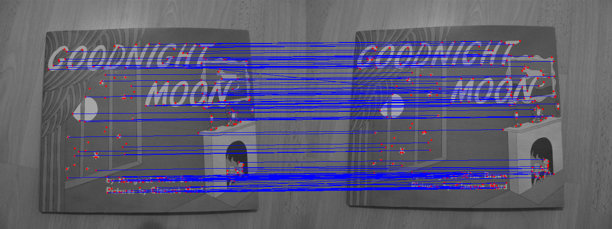

## Project 2: Recognition

### k-means clustering

Implementation of the k-means algorithm, used here to group the pixels of an image by colour. On
the left is the original photo of the ETH main building, on the right the result with 5 clusters.

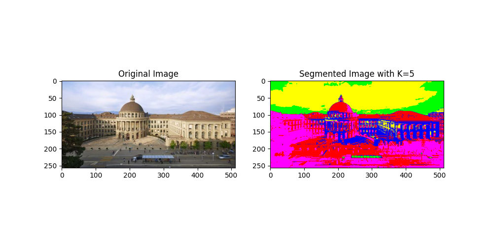

### Bag of Words

Training a Bag of Words model to classify images, if they contain a car (positive sample) or not
(negative sample). The following are examples of images which the algorithm is able to
differentiate between. Cars on the top row, empty road on the bottom row.

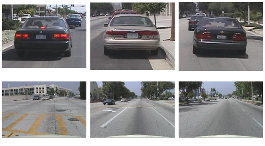

The model classified 100% of the positive and 96% of the negative test images correctly.

## Project 3: Deep Learning

Building and training neural networks in PyTorch. The first task shows why depth matters. A simple
linear model can only separate the two groups of points with a straight line, while a small neural
network learns a boundary that follows the shape of the data.

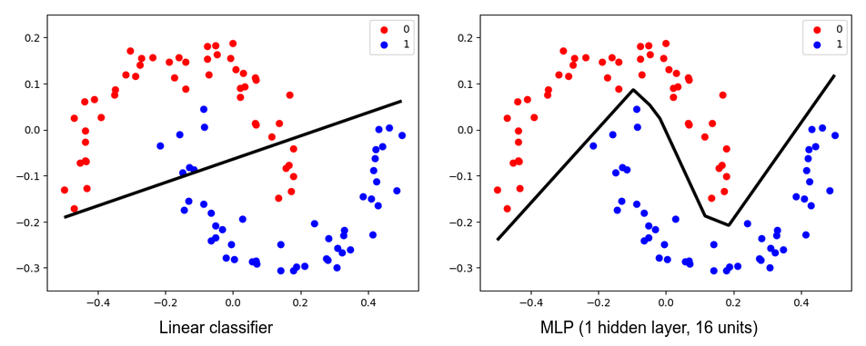

The same code is then scaled up to real image datasets, reaching 97.3% accuracy on MNIST with a
fully connected network and 99.0% with a convolutional one, plus a CNN trained on CIFAR-10.

## Project 4: Image Segmentation

### Mean-Shift Segmentation

Using the Mean-Shift algorithm applied to colour space, we can segment an image into different
regions. The following images show the input and output of the algorithm.

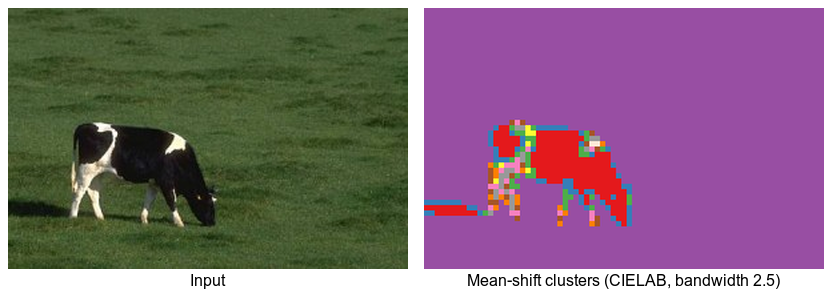

### SegNet

Implementation of a lite version of SegNet. The network was trained on a modified version of the
MNIST dataset, where it has to find each digit in an image, label it correctly and colour code
every pixel according to that label. It reached a mean IoU score of 0.871.

## Project 5: Generative Models

Implementation of a Variational AutoEncoder (VAE), a model that learns to generate new images.
Below are digits it produced from pure random noise, having never seen them before.

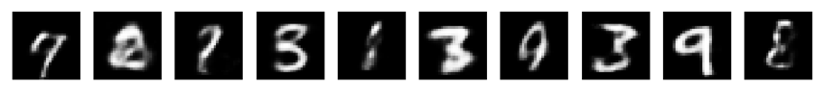

I also implemented a Conditional VAE, which can be told which digit to draw. Each row below was
generated on request for one specific digit, from 0 at the top to 9 at the bottom.

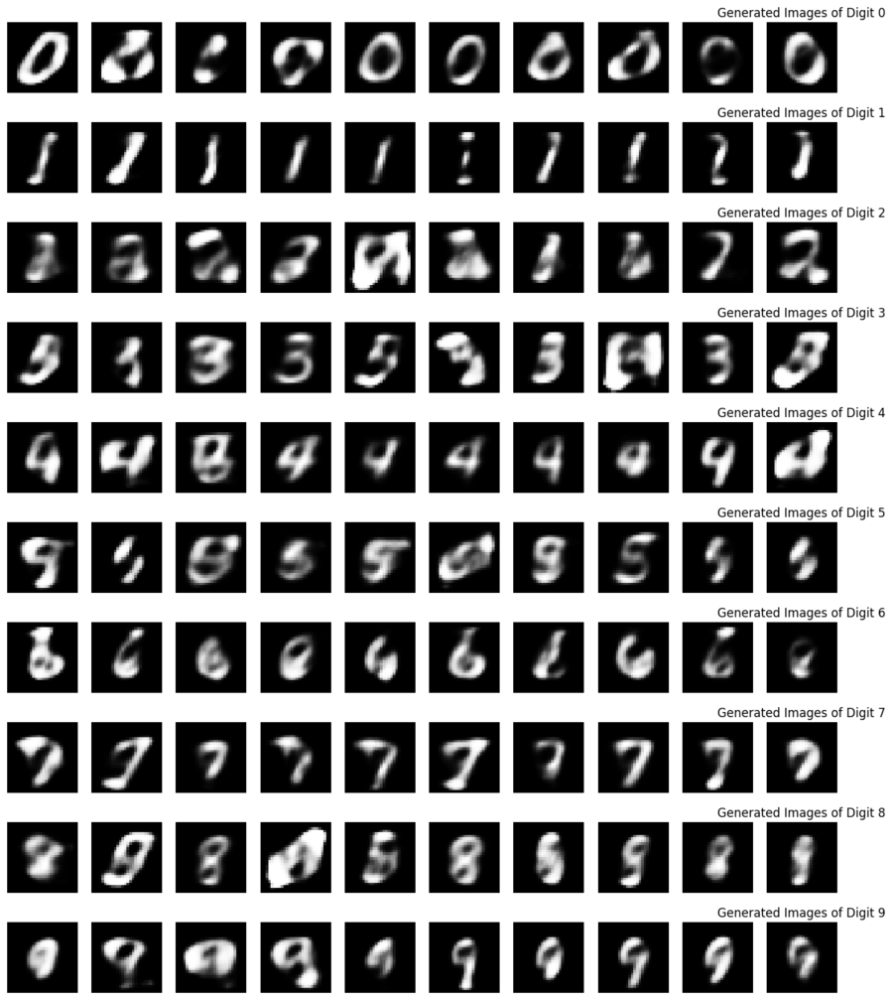

## Project 6: Structure from Motion

Given a set of images and correspondences between them, we can reconstruct the 3D structure of the
scene, by estimating the relative camera poses and triangulating the 3D points.

Examples of the input images:

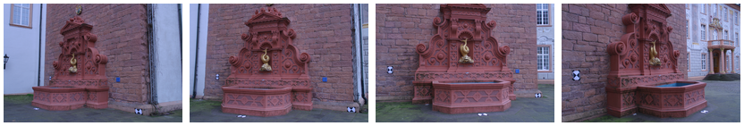

Resulting 3D reconstruction and camera poses. Each camera is depicted as a blue box and each 3D
point as a black dot:

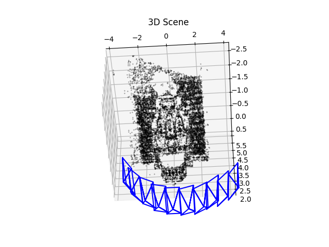

The project also covers RANSAC, a method for fitting a model to data that contains outliers. Plain
least squares (navy) is pulled off course by the outliers at the bottom, while RANSAC (light blue)
ignores them and recovers the correct line.

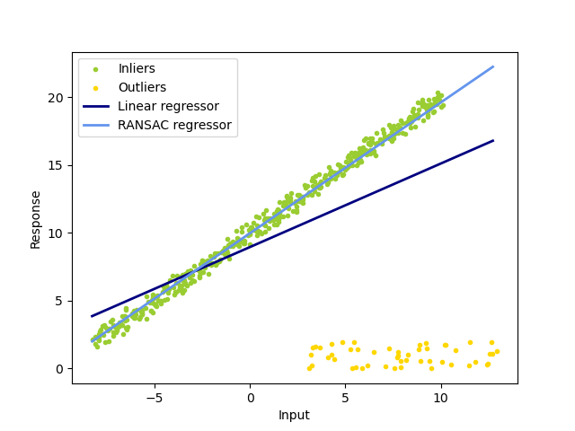
